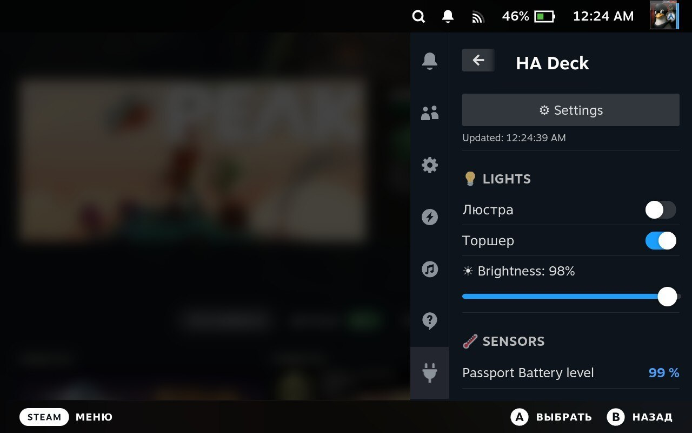
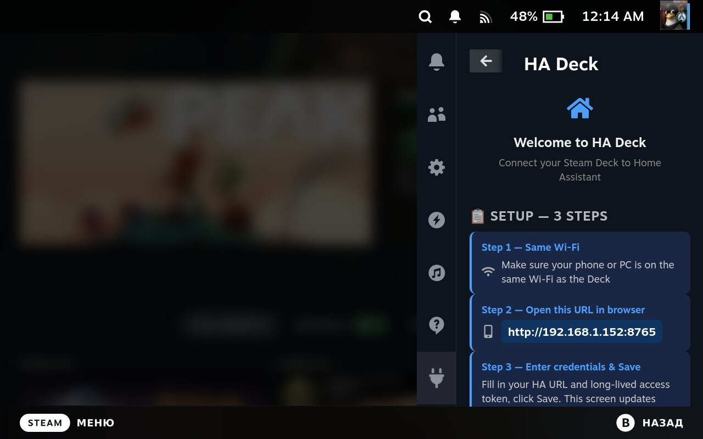
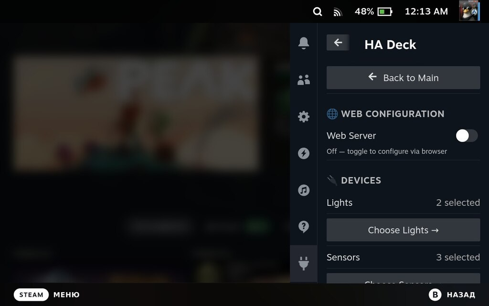

# HA Deck 🏠

Control [Home Assistant](https://www.home-assistant.io/) directly from your Steam Deck's Quick Access Menu.

> ⭐ **If you find this plugin useful, please consider giving it a star on GitHub — it helps others discover the project and motivates further development. Thank you!**
> 
> [](https://github.com/Marker284/ha-deck/stargazers)

## Screenshots

| Main | Setup | Settings |
|------|-------|----------|
|  |  |  |

## Features

- 💡 **Lights** — toggle on/off, brightness slider, color temperature
- 🔌 **Switches** — control switches, input booleans, automations, scripts
- 🌡️ **Climate** — set HVAC mode, target temperature, view current temperature and action
- 💨 **Fans** — toggle, variable speed slider, preset modes
- 📊 **Sensors** — view temperature, humidity, and other sensor values
- ⚙️ **Easy setup** — configure via browser on your phone or PC (no typing on the Deck)
- 🔄 **Auto-refresh** — updates every 30 seconds while panel is open; stops when closed

## Installation

> 🕐 **Decky Plugin Store submission is in progress.** Once approved, you'll be able to install directly from the store.

**Manual install (available now):**
1. Open Decky Loader → click the ⚙️ icon (Settings)
2. Scroll down to **Developer** → enable **Developer Mode**
3. A new **Developer** tab appears — open it
4. Click **Install plugin from URL**
5. Go to [Releases](https://github.com/Marker284/ha-deck/releases), right-click `ha-deck-vX.X.X.zip` → Copy link
6. Paste the URL and confirm install

## Setup

1. Install the plugin
2. Open Quick Access Menu → HA Deck
3. On first launch you'll see a setup screen with a URL like `http://192.168.x.x:8765`
4. Open that URL on your phone or PC (same Wi-Fi)
5. Enter your Home Assistant URL and a [Long-Lived Access Token](https://developers.home-assistant.io/docs/auth_api/#long-lived-access-token)
6. Click Save — the Deck updates automatically

## Configuration

After initial setup, go to **Settings** to:
- Select which lights/switches/climate/fans/sensors to show
- Reconfigure HA credentials (toggle Web Server on)
- Reset all settings

## Requirements

- [Decky Loader](https://decky.xyz/) installed on Steam Deck
- Home Assistant instance accessible on the same local network
- A Long-Lived Access Token from HA (Profile → Security → Long-lived access tokens)

## Building from source

```bash
pnpm install
pnpm run build
```

## Contributing & Feedback

Found a bug or missing a feature? **[Open an issue](https://github.com/Marker284/ha-deck/issues/new)** — all reports and suggestions are welcome.

## License

BSD 3-Clause — see [LICENSE](LICENSE)
